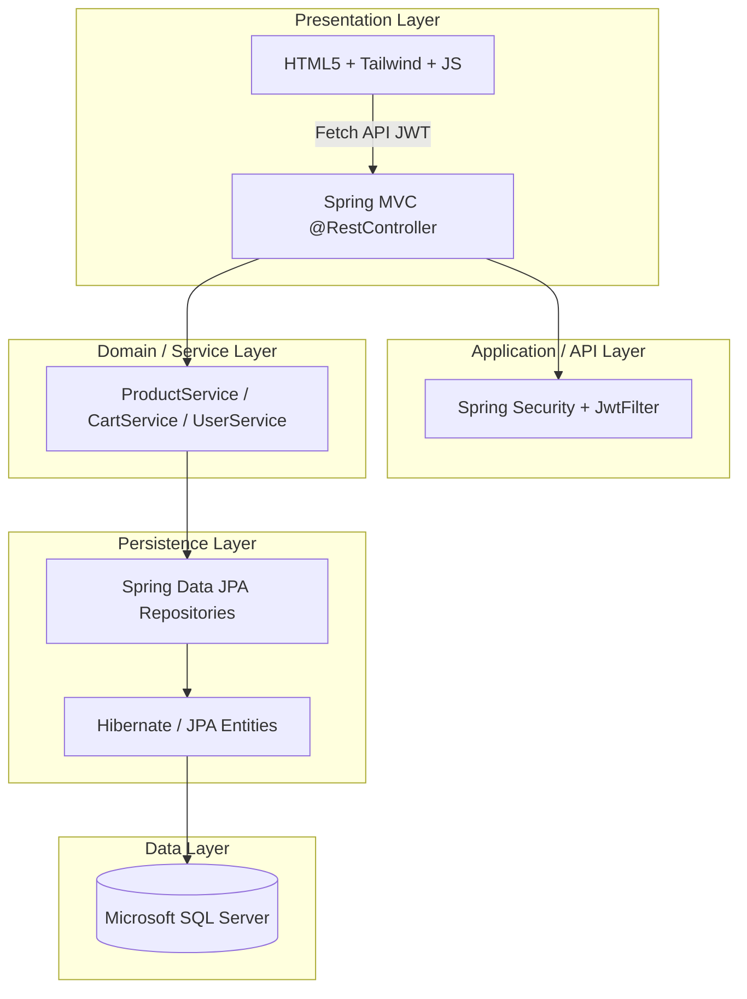
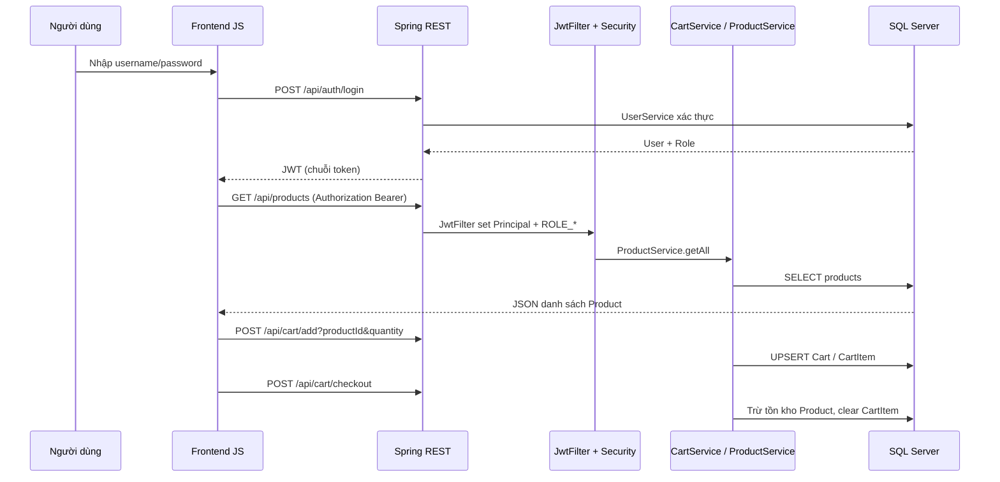

# Tài liệu kỹ thuật: The Suits House

## Thông tin dự án

| Hạng mục | Nội dung |
|----------|-----------|
| Tên sản phẩm | The Suits House — cửa hàng suit / vest / trang phục lịch lãm |
| Mô hình triển khai | **Client–Server**: trình duyệt (SPA nhẹ) + API REST + CSDL quan hệ |
| Repository tham chiếu | `shop-demo/backend` (Java), `shop-demo/frontend` (HTML/CSS/JS) |

---

## 1. Kiến trúc tổng quan hệ thống (System Architecture)

### 1.1. Mô hình phân tầng (Layered Architecture)

Hệ thống tuân theo **tách lớp cổ điển**, phù hợp báo cáo và dễ mở rộng:

- **Presentation**: Một trang `index.html` điều khiển nhiều “màn hình” ẩn/hiện (`pageLogin`, `pageProducts`, `page-detail`, `page-checkout`, `page-admin`) — hành vi gần **Single Page Application** (không reload full page khi chuyển view).
- **Application**: Các `*Controller` map URL REST; `SecurityConfig` + `JwtFilter` xử lý xác thực trước khi vào controller (trừ endpoint public).
- **Domain / Service**: `*Service` gói nghiệp vụ (giỏ hàng, sản phẩm, user).
- **Persistence**: `JpaRepository` + entity mapping.
- **Database**: SQL Server qua JDBC (`mssql-jdbc`).

### 1.2. Luồng dữ liệu điển hình (End-to-end Data Flow)

**Ví dụ: Khách đăng nhập → xem sản phẩm → thêm giỏ → thanh toán**

**Diễn giải theo từng bước**

1. **Tương tác UI**: Người dùng thao tác trên DOM; `app.js` gọi `fetch()` kèm header `Authorization: Bearer <jwt_token>`.
2. **REST**: Spring Boot nhận HTTP, deserialize JSON/query params vào tham số method.
3. **Bảo mật**: `JwtFilter` đọc JWT, trích `username` và `role`, gán `SimpleGrantedAuthority("ROLE_" + role)` — khớp với `hasRole("ADMIN")` trong `SecurityConfig`.
4. **Nghiệp vụ**: Ví dụ `CartService.checkout` duyệt `CartItem`, kiểm tra tồn kho, cập nhật `Product.quantity`, sau đó `cart.getItems().clear()` và lưu.
5. **CSDL**: Hibernate sinh/cập nhật bảng theo `ddl-auto=update` trong `application.properties`.

### 1.3. Các endpoint API chính (thực tế trong mã)

| Nhóm | Method & đường dẫn | Ghi chú bảo mật |
|------|-------------------|-----------------|
| Auth | `POST /api/auth/login`, `POST /api/auth/register` | `permitAll` |
| Static | `/uploads/**` | `permitAll` (phục vụ ảnh cục bộ) |
| Admin | `POST/PUT/DELETE /api/admin...`, `GET /api/admin/test` | `hasRole("ADMIN")` |
| Sản phẩm | `GET /api/products`, `GET /api/products/{id}`, … | `authenticated` (theo cấu hình hiện tại) |
| Giỏ hàng | `GET/POST/DELETE /api/cart/...` | `authenticated` |

**Lưu ý kiến trúc (để báo cáo thẳng thắn):** `ProductController` vẫn expose `POST/PUT/DELETE` cho mọi user đã đăng nhập; trong hệ thống “chuẩn production”, các thao tác ghi sản phẩm thường **chỉ** nằm dưới `/api/admin` hoặc được bảo vệ role riêng.

---

## 2. Bản đồ chức năng chi tiết (Product Capabilities & Features)

Phần này trình bày **vision** của hai phân hệ. Với mỗi mục có thêm cột **Hiện trạng mã nguồn** để dùng làm “scope thực tế vs roadmap” trong đồ án.

### 2.1. Phân hệ Khách hàng (Storefront)

| Tính năng | Mô tả nghiệp vụ | Hiện trạng mã nguồn (`shop-demo`) |
|-----------|-----------------|-----------------------------------|
| **Trang chủ / showcase** | Banner, sản phẩm nổi bật, best seller | **Một phần**: có lưới sản phẩm từ DB, filter tag, phân trang; **chưa** có banner carousel hay block “Best seller” đo bằng doanh số (chưa có bảng đơn hàng thật). |
| **Danh mục & bộ lọc** | Nam/Nữ, khoảng giá, tìm kiếm tên | **Nam/Nữ & ngữ cảnh suit**: lọc theo `tags` (chuỗi CSV trên entity `Product`, ví dụ `nam`, `nu`, `cong-so`). **Chưa** có slider giá hay ô search theo tên trên UI (có thể mở rộng bằng query JPA + input ở frontend). |
| **Chi tiết sản phẩm** | Size, chất liệu, phom | **UI size S/M/L/XL** có nút (chưa gắn logic đổi SKU): mô tả tồn kho/ghép copy “The Suits House” trong `detail-desc`. **Chất liệu/phom** chưa là field DB — đang mô phỏng bằng text cố định. |
| **Đánh giá & phản hồi** | 5 sao, bình luận, điểm TB | **Phía client**: mảng `reviews` gắn vào object sản phẩm trong bộ nhớ, có seed demo và form gửi đánh giá; **không** persist qua API/DB → mất khi F5 (trừ seed lại cho SP đầu tiên). |
| **Giỏ hàng** | Thêm/sửa/xóa, tổng tiền | **Server-side cart**: `Cart` 1–1 `User`, `CartItem` many-to-one `Product`. **Thêm** (`POST /api/cart/add`), **xóa dòng** (`DELETE /api/cart/remove`). **Sửa số lượng** chi tiết trên UI **chưa** (chỉ cộng quantity qua add). Tổng tiền render từ JSON giỏ trả về. |
| **Thanh toán** | Form giao hàng, COD/chuyển khoản, tạo đơn | **UI đầy đủ**: form địa chỉ, radio COD/transfer, tính phí ship/miễn phí ở client. **Backend**: `POST /api/cart/checkout` chỉ xử lý **xóa giỏ + trừ kho**; **không** nhận payload đơn hàng, **không** lưu `Order` / trạng thái giao hàng / phương thức thanh toán. |
| **Đăng ký / đăng nhập** | Tài khoản khách | **Có**: form register (`role: 'USER'`), login lưu JWT vào `localStorage`. |

### 2.2. Phân hệ Quản trị (Admin Panel)

| Tính năng | Mô tả | Hiện trạng mã nguồn |
|-----------|--------|---------------------|
| **Đăng nhập admin** | Session/role riêng | JWT kèm `role` trong payload; UI decode JWT để hiện nút “Quản trị”, gọi `GET /api/admin/test` để **double-check** phiên ADMIN. |
| **CRUD sản phẩm + upload ảnh** | Multipart, lưu `/uploads/` | **Backend**: `AdminController` nhận `Product` JSON (`POST /api/admin`), không có `MultipartFile` trong codebase. **`WebConfig`** map `/uploads/**` tới thư mục `app.upload.dir`; **Security** mở public static uploads. **SQL seed** (`seed-suits.sql`) minh họa `image_url` dạng `/uploads/{uuid}.jpg`. **Frontend admin**: form file chỉ **preview** bằng `URL.createObjectURL`; submit đẩy vào mảng `allProducts` local — **mô phỏng**, chưa gọi API tạo sản phẩm thật + upload. |
| **Quản lý đơn hàng** | Trạng thái pipeline | **Chưa** có entity Order; không có màn admin đơn hàng. |
| **Dashboard** | Doanh thu, số đơn, low stock | **Một phần gián tiếp**: có trường `Product.quantity` để sau này làm “sắp hết hàng”; **chưa** API/dashboard tổng hợp. |

---

## 3. Lớp công nghệ (Technology Stack) & vai trò

### 3.1. Frontend

| Công nghệ | Vai trò cụ thể trong The Suits House | Lý do phù hợp “luxury minimal” |
|-----------|----------------------------------------|--------------------------------|
| **HTML5** | Cấu trúc semantic, nhiều section/page ẩn trong một document | Chuẩn hóa, SEO-ready nếu sau này tách route SSR. |
| **Tailwind CSS** (CDN `tailwindcss.com`) | Utility-first: glassmorphism header, bảng màu slate/indigo, spacing đồng nhất | Prototype nhanh, giao diện hiện đại, dễ giữ **nhất quán thương hiệu** (The Suits House: tối nền + accent indigo/amber). |
| **JavaScript (ES module style trong file đơn)** | `fetch` async, quản lý state view, format tiền VNĐ, JWT trong `localStorage` | SPA nhẹ **không** cần build step; phù hợp đồ án/training. |
| **Lucide (icons)** | Iconography trên nút, toast, nav | Tăng cảm giác “product polish”. |

*(Gợi ý báo cáo nâng cao: Tailwind qua CDN tiện dev nhưng production thường dùng JIT build + purge CSS.)*

### 3.2. Backend

| Công nghệ | Vai trò |
|-----------|---------|
| **Java 17 + Spring Boot 3.2.5** | Nền tảng chuẩn doanh nghiệp, cấu hình convention-over-configuration. |
| **Spring Web** | REST controller, JSON, CORS `@CrossOrigin`. |
| **Spring Data JPA** | `ProductRepository`, `CartRepository`, `UserRepository` — giảm boilerplate SQL. |
| **Spring Security** | `SecurityFilterChain`, stateless session, phân quyền theo role trên path. |
| **JJWT 0.12.3** | Sinh/parse JWT (`JwtUtil`), claims `username` + `role`. |

### 3.3. Database

| Công nghệ | Vai trò |
|-----------|---------|
| **Microsoft SQL Server** | CSDL quan hệ: toàn vẹn tham chiếu, transaction; JDBC URL trong `application.properties` (`encrypt=true;trustServerCertificate=true` phục vụ dev local). |
| **Hibernate `ddl-auto=update`** | Tự động cập nhật schema theo entity (thích hợp dev; production thường dùng migration có kiểm soát). |

---

## 4. Giải pháp kỹ thuật & tối ưu hệ thống

### 4.1. Xác thực & phân quyền (Authentication & Authorization)

**Cơ chế:** **Bearer JWT** + **stateless** (`SessionCreationPolicy.STATELESS`).

- **Đăng nhập**: `AuthController` trả về chuỗi JWT khi `UserService.login` thành công; thất bại trả `"LOGIN FAILED"` (client đọc text).
- **Mỗi request (trừ `/api/auth` và static)**: `JwtFilter` đọc header, xác thực chữ ký/thời hạn token, gán `UsernamePasswordAuthenticationToken` với authority `ROLE_ADMIN` hoặc `ROLE_USER` tùy claim.
- **Admin-only**: `SecurityConfig` — `.requestMatchers("/api/admin/**").hasRole("ADMIN")`.
- **Hardening cho báo cáo nâng cao**: password hiện lưu **plain** trong entity (cần **BCrypt** + `PasswordEncoder`); có thể bổ sung refresh token, blacklist logout, HTTPS bắt buộc.

### 4.2. Quản lý trạng thái (State Management)

| Thành phần | Cách lưu / đồng bộ | Ghi chú trung thực với đồ án |
|------------|-------------------|------------------------------|
| **Phiên đăng nhập** | `localStorage.jwt_token` | Đủ cho demo; cần cân nhắc XSS. |
| **Danh sách sản phẩm + filter** | Biến `allProducts`, `activeTagFilter`, `currentPage` trong RAM trình duyệt | Nguồn truth là API sau mỗi `fetchProducts()`. |
| **Giỏ hàng** | **Persistence trên server** (`Cart`/`CartItem` trong DB), client chỉ render | **Khác** với giả định “LocalStorage giỏ tạm”: đây là mô hình **authenticated cart** tốt cho đồng bộ đa thiết bị nhưng phụ thuộc login. |
| **Đánh giá** | Mảng `reviews` trên object JS | Nên nâng cấp thành entity + API nếu muốn “production-ready”. |

### 4.3. Xử lý tệp tin (File Handling)

**Thiết kế hiện có**

- `app.upload.dir` trỏ thư mục `uploads`; `WebConfig` publish URL `/uploads/**`.
- Seed SQL gán `image_url` dạng `/uploads/filename.jpg` — trình duyệt resolve `API_BASE + path`.
- `SecurityConfig` cho phép đọc ảnh không cần JWT.

**Hướng hoàn thiện Multipart (đề xuất trong báo cáo)**

1. Endpoint `POST /api/admin/products` nhận `MultipartFile`.
2. Lưu file với tên UUID, trả về đường dẫn public `/uploads/...`.
3. Cập nhật `Product.imageUrl` trong transaction.
4. Tùy chọn: lưu trữ đám mây (S3/Azure Blob) + CDN.

### 4.4. Thiết kế & tối ưu CSDL

**Quan hệ thực tế trong code**

| Quan hệ | Hiện thực JPA | Ý nghĩa nghiệp vụ |
|---------|----------------|-------------------|
| User — Cart | `@OneToOne` trên `Cart.user` | Mỗi user một giỏ. |
| Cart — CartItem | `@OneToMany` + `orphRemoval`, `cascade` | Dòng giỏ là tập con của giỏ; xóa giỏ/xóa item cascade hợp lý. |
| CartItem — Product | `@ManyToOne` | Một sản phẩm xuất hiện trong nhiều giỏ khác nhau. |

**Quan hệ “đơn hàng” theo đặc tả đồ án (roadmap)** — *chưa có trong repo, nên trình bày như thiết kế mục tiêu:*

- `Order` **1—N** `OrderLine` (chi tiết: product snapshot, qty, price tại thời điểm mua).
- **Index đề xuất**: `products(name)` hoặc full-text tùy SQL Server edition; index `orders(user_id, created_at)`; `order_lines(order_id)`.

**Tối ưu truy vấn**

- Danh sách sản phẩm hiện `findAll()`: với catalog lớn cần **phân trang server-side** (`Pageable`) và filter (`Specification` / native query).
- Tránh N+1 khi serialize `Cart` có nhiều `CartItem`: dùng `@EntityGraph` hoặc JOIN FETCH.

---

## 5. Kết luận & định hướng

**Điểm mạnh hiện tại:** Kiến trúc phân tầng rõ ràng; JWT + role ADMIN; giỏ hàng và tồn kho gắn với transaction checkout; UI luxury-oriented với Tailwind; SQL Server đảm bảo ACID.

**Khoảng cách so với mô tả nghiệp vụ đầy đủ:** Đơn hàng + trạng thái giao hàng, dashboard admin, tìm kiếm/lọc giá, đánh giá persistent, upload ảnh end-to-end, và hardening bảo mật mật khẩu là các hạng mục **ưu tiên** để hoàn thiện thành sản phẩm thương mại.
